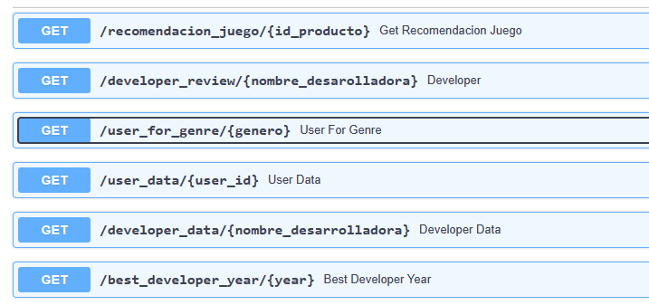

# PI ML OPS - Daniel Gonzalez

El proyecto cuenta con seis (6) Endpoints.




## ✨ Tecnologias usadas:

 - fastapi
  - uvicorn
  - python
  - pandas
  - scikit-learn


## 📝 Funcionamiento:

```
def user_data( User_id : str ):  Debe devolver cantidad de dinero gastado por el usuario, el porcentaje de recomendación en base a reviews.recommend y cantidad de items.
```
```
def user_for_genre( genero : str ): Debe devolver el usuario que acumula más horas jugadas para el género dado y una lista de la acumulación de horas jugadas por año.
```
```
def best_developer_year( año : int ): Devuelve el top 3 de desarrolladores con juegos MÁS recomendados por usuarios para el año dado. (reviews.recommend = True y comentarios positivos)
```
```
def developer_review( desarrolladora : str ): Según el desarrollador, se devuelve un diccionario con el nombre del desarrollador como llave y una lista con la cantidad total de registros de reseñas de usuarios que se encuentren categorizados con un análisis de sentimiento como valor positivo o negativo.
```
```
def developer( desarrollador : str ): Cantidad de items y porcentaje de contenido Free por año según empresa desarrolladora.
```
# Modelo de Aprendizaje Automatico

Una vez que toda la data es consumible por la API, está lista para consumir por los departamentos de Analytics y Machine Learning, y nuestro EDA nos permite entender bien los datos a los que tenemos acceso, es hora de entrenar nuestro modelo de machine learning para armar un sistema de recomendación.
```
def recomendacion_juego( id de producto ): Ingresando el id de producto, deberíamos recibir una lista con 5 juegos recomendados similares al ingresado.
```